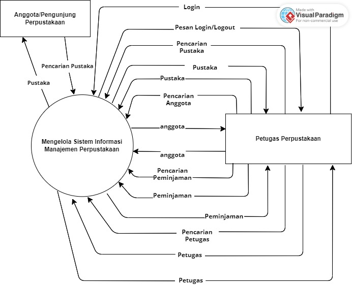
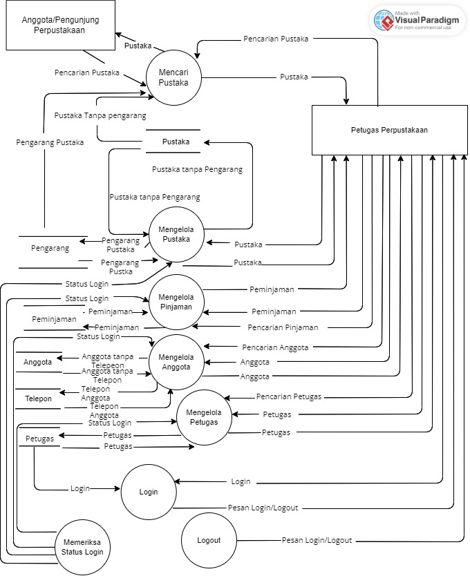
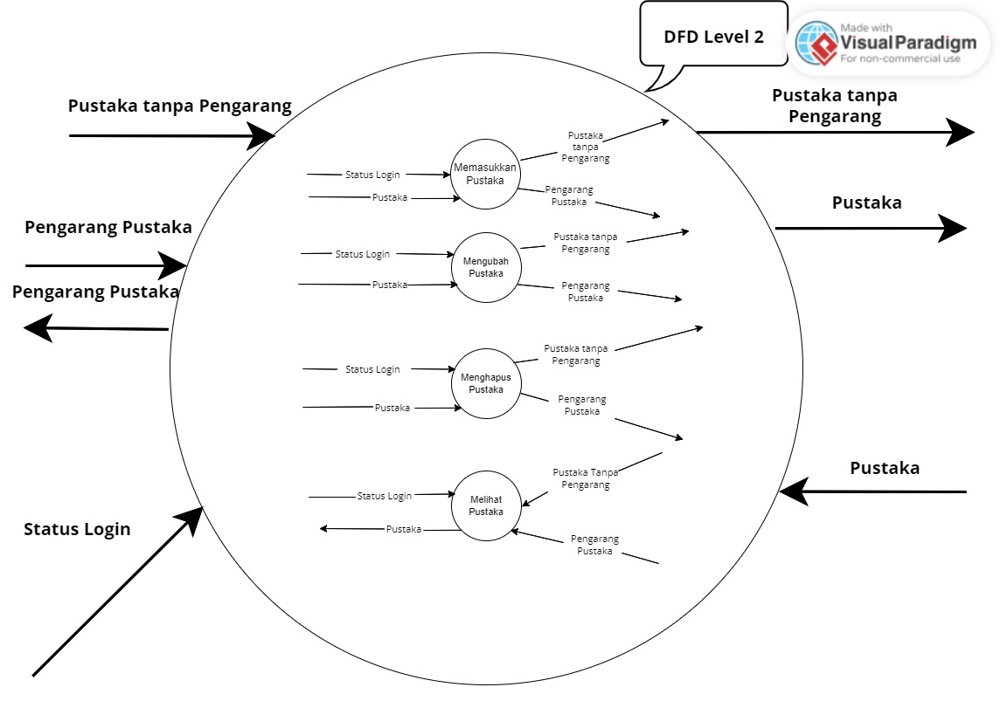
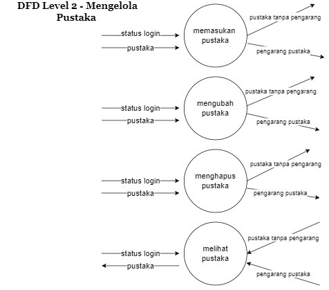
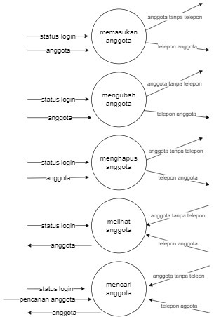
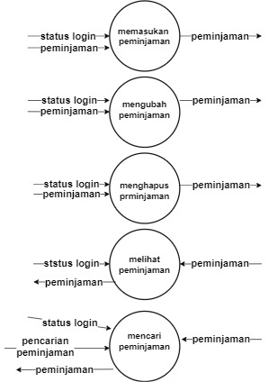
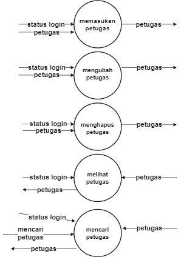
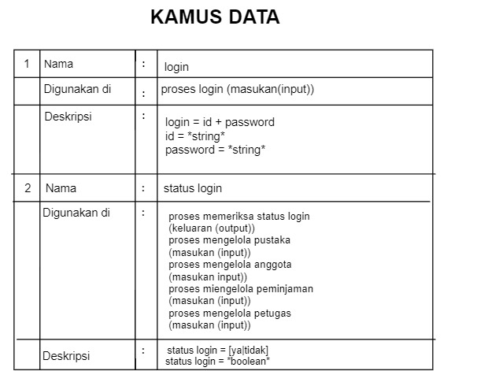

# studi-kasus-data-flow-diagram
# dfd level 0

[Anggota/pengunjung perpustakaan]   pengunjung yang ingin meminjam ke perpustakaan
 
[prtugas perpustakaan]   petugas yang memenuhi permintaan dari pengunjung yang di dapat dari sistem
 
(mengelola sistem informasi manajemen perpustakaan)   sistem yang mengelola permintaan pengunjung dan 
memenuhi permintaan pengunjung yang di dapatkan dari prtugas
 
-si pengunjung melakukan pencarian pustaka di sistem informasi
 manajemen perpus. 
-sistem memberitahukan si admin agar login ke sistem manajemen
 perpus. 
-lalu si sistem memberikan pesan ke admin bahwa admin sudah login 
 ke sistem manajemen perpus. 
-lalu admin perpus masuk ke dalam sistem manajement perpus. 
-setelah login admin perpus melakukan pencarian daftar pustaka
 dari daftar perpus yg di cari oleh pengunjung. 
-lalu sistem memberikan pustaka yg dicari oleh admin. 
-lalu admin mencarikan seorang yg berada di sistem perpus
 untuk mencari pustaka yg di cari oleh pengunjung. 
-sistem meminta izin akses peminjaman yg diminta oleh pengunjung perpus. 
-lalu admin memberikan akses peminjman kepada sistem untuk meminjmkan buku 
 kepada pengunjung. 
-admin melakukan pencarian peminjaman di sistem. 
-lalu admin melakukan pencarian anggota yg meminjam pustaka. 
-apa bila sudah ketemu sistem memberikan pustaka yg dicari oleh pengunjung 
 atas izin admin. 

# dfd level 1

# dfd level 2 no 1

# dfd level 2 no 2

# dfd level 2 no 3

# dfd level 2 no 4

# dfd level 2 no 5

# kamusdata
 