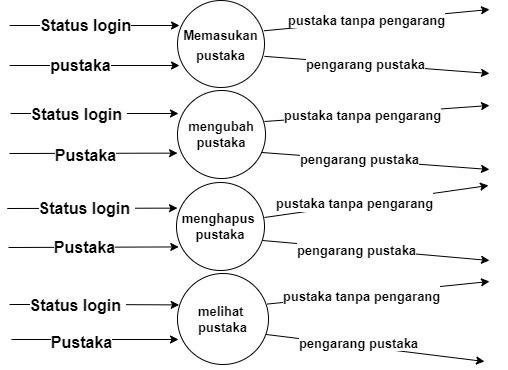
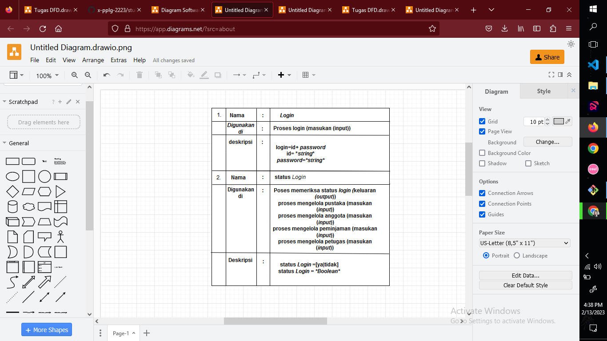

# studi-kasus-data-flow-diagram
# dfd level 0

[Anggota/Pengunjung perpustakaan]
pengunjung yang ingin meminjam ke perpustakaan
(mengelola sistem informasi manajemen perpustakaan)
sistem yang mengelola permintaan pengunjung dan memenuhi permintaan pengunjung yang di dapatkan dari petugas
[Petugas Perpustakaan]
petugas yang memenuhi permintaan dari pengunjung yang di dapat dari sistem pengelola
aliran data >>
-pencarian pustaka- anggota/pengunjung melakukan pencarian pustaka di sistem informasi 
-login- petugas perpustakaan melakukan login pada sistem informasi 
-pesan login/logout- sistem informasi memberikan notif/pesan kepada petugas perpustakaan 
-pencarian pustaka- petugas perpustakaan mengirim pencarian pustaka ke sistem informasi 
-pustaka- sistem informas memberikan pustaka pada petugas perpustakaan 
-pustaka- petugas perpustakaan memberikan pustaka yang dicari pengunjung ke sistem informasi 
-pencarian anggota- petugas perpustakaan melakukan pencarian anggota di database sistem informasi 
-anggota- sistem informasi memberikan data anggota pada petugas perpustakaan 
-anggota- petugas perpustakaan memberikan akses anggota kepada sistem informasi 
-pencarian peminjaman- petugas perpustakaan melakukan pencarian peminjaman di sistem informasi 
-peminjaman- petugas perpustakaan melakukan peminjaman pada sistem informasi 
-peminjaman- sistem memberikan peminjaman ke petugas perpustakaan .
-pencarian petugas- petugas mencari data petugas 
-petugas- petugas memberikan akses untuk memberikan pustaka 
-petugas- sistem informasi memberikan konfirmasi pada petugas perpustakaan 
-pustaka- sistem memberikan pustaka pada anggota/pengunjung perpustakaan 

# dfd level 1

# dfd level 2 no1

# dfd level 2 no2

Proses Memasukkan pustaka:
-status login- proses mengambil dan mengecek data status login dari proses sebelumnya 
-pustaka- proses mengambil data pustaka yang ingin dimasukkan 
-pustaka tanpa pengarang- proses memberikan data data pustaka tanpa pengarang yang ingin dimasukkan 
-pengarang pustaka- proses memeberikan data data pengarang pustaka yang ingin dimasukkan 
Proses Mengubah pustaka: 
-status login- proses mengambil dan mengecek data status login dari data sebelumnya 
-pustaka- proses mengambil data pustaka yang ingin diubah 
-pustaka tanpa pengarang- proses memberikan data data pustaka tanpa pengarang yang ingin diubah 
-pengarang pustaka- proses memberikan data data pengarang pustaka yang ingin diubah 
Proses Menghapus pustaka: 
-status login- proses mengambil dan mengecek data status login dari proses sebelumnya 
-pustaka- proses mengambil data pustaka yang ingin dihapus 
-pustaka tanpa pengarang- proses memberikan data data pustaka tanpa pengarang yang ingin di hapus 
-pengarang pustaka- proses memberikan data data pengarang pustaka yang ingin di hapus 
Proses Melihat pustaka: 
-status login- proses mengambil dan mengecek data status login dari proses sebelumnya 
-pustaka- proses memberikan data pustaka yang ingin dilihat 
-pustaka tanpa pengarang- proses mengambil data pustaka tanpa pengarang yang ingom di lihat 
-pengarang pustaka- proses mengambil data pengarang pustaka yang ingin di lihat 
# dfd level 2 no3

Proses Memasukkan anggota: 
-status login- proses mengambil dan mengecek data status login dari data sebelumnya 
-anggota- proses mengambil data anggota yang ingin dimasukkan 
-anggota tanpa telepon- proses mengirim data data anggota tanpa telepon yang ingin di masukkan 
-telepon anggota- proses mengirim data data telepon anggota yang ingin di masukkan 
Proses Mengubah anggota: 
-status login- proses mengambil dan mengecek data status login dari data sebelumnya 
-anggota- proses mengambil data anggota yang ingin di ubah  -anggota tanpa telepon- proses mengirim data anggota tanpa telepon yang ingin di ubah 
-telepon anggota- proses mengirim data telepon anggota yang ingin di ubah 
Proses Menghapus anggota: 
-status login- proses mengambil dan mengecek data status login dari data sebelumnya 
-anggota- proses mengambil data anggota yang ingin di hapus 
-anggota tanpa telepon- proses mengirim data tanpa telepon yang ingin di hapus 
-telepon anggota- proses mengirim data telepon anggota yang  ingin dihapus 
Proses Melihat anggota: 
-status login- proses mengambil dan mengecek data status login dari data sebelumnya 
-anggota- proses mengirim data pustaka yang ingin dilihat 
-anggota tanpa telepon- proses mengambil data anggota tanpa telepon yang ingin dilihat 
-telepon anggota- proses mengambil data anggota tanpa telepon yang ingin dilihat 
Proses Mencari anggota: 
-status login- proses mengambil dan mengecek data status login dari data sebelumnya 
-pencarian anggota- proses mengambil dan mengecek data anggota yang ingin dicari 
-anggota- proses mengirim data anggota yang dicari 
-anggota tanpa telepon- proses mengambil data anggota tanpa telepon yangg dicari 
-telepon anggota- proses mengambil data telepon anggota yang dicari 
# dfd level 2 no4

Proses Memasukkan peminjaman: 
-status login- proses mengambil dan mengecek data status login dari data sebelumnya 
-peminjaman- proses mengambil dan mengirim data peminjaman yang ingin dimasukkan 
Proses Mengubah peminjaman: 
-status login- proses mengambil dan mengecek data status login dari data sebelumnya 
-peminjaman- proses mengambil dan mengirim data peminjaman yang ingin diubah 
Proses Menghapus peminjaman: 
-status login- proses mengambil dan mengecek data status login dari data sebelumnya 
-peminjaman- proses mengambil dan mengirim data peminjaman yang ingin dihapus 
Proses Melihat peminjaman: 
-status login- proses mengambil dan mengecek data status login dari data sebelumnya 
-pemijaman- proses mengambil dan mengirim data peminjaman yang ingin dilihat 
Proses Mencari peminjaman: 
-status login- proses mengambil dan mengecek data status login dari data sebelumnya 
-pencarian peminjaman- proses mengambil data peminjaman yang di cari 
-pemijaman- proses mengambil dan mengirim data peminjaman yang di cari 
# dfd level 2 no5

Proses Memasukkan Petugas: 
-status login- proses mengambil dan mengecek data status login dari data sebelumnya 
-petugas- proses mengambil dan mengirim data petugas yang ingin dimasukkan 
Proses Mengubah Petugas: 
-status login- proses mengambil dan mengecek data status login dari data sebelumnya 
-petugas- proses mengambil dan mengirim data petugas yang ingin diubah 
Proses Menghapus Petugas: 
-status login- proses mengambil dan mengecek data status login dari data sebelumnya 
-petugas- proses mengambil dan mengirim data petugas yang ingin dihapus 
Proses Melihat Petugas: 
-status login- proses mengambil dan mengecek data status login dari data sebelumnya 
-petugas- proses mengambil dan mengirim data petugas yang ingin dilihat 
Proses Mencari Petugas: 
-status login- proses mengambil dan mengecek data status login dari data sebelumnya 
-mencari petugas- proses mengambil data petugas yang dicari 
-petugas- proses mengambil dan mengirim data petugas yang dicari 
# Kamus Data 
