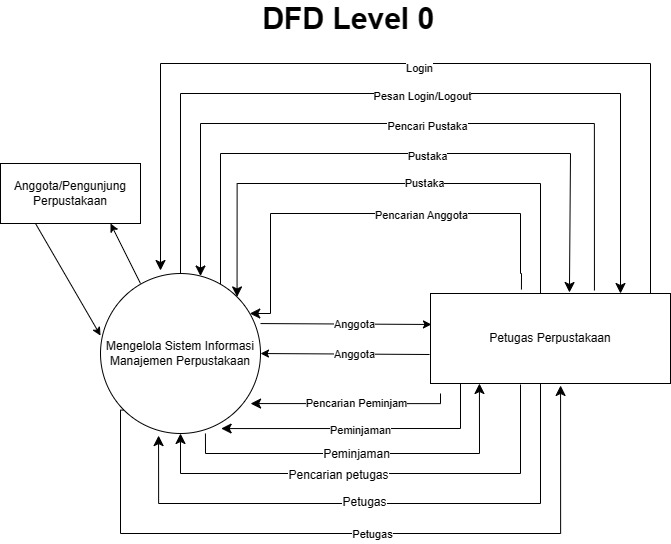
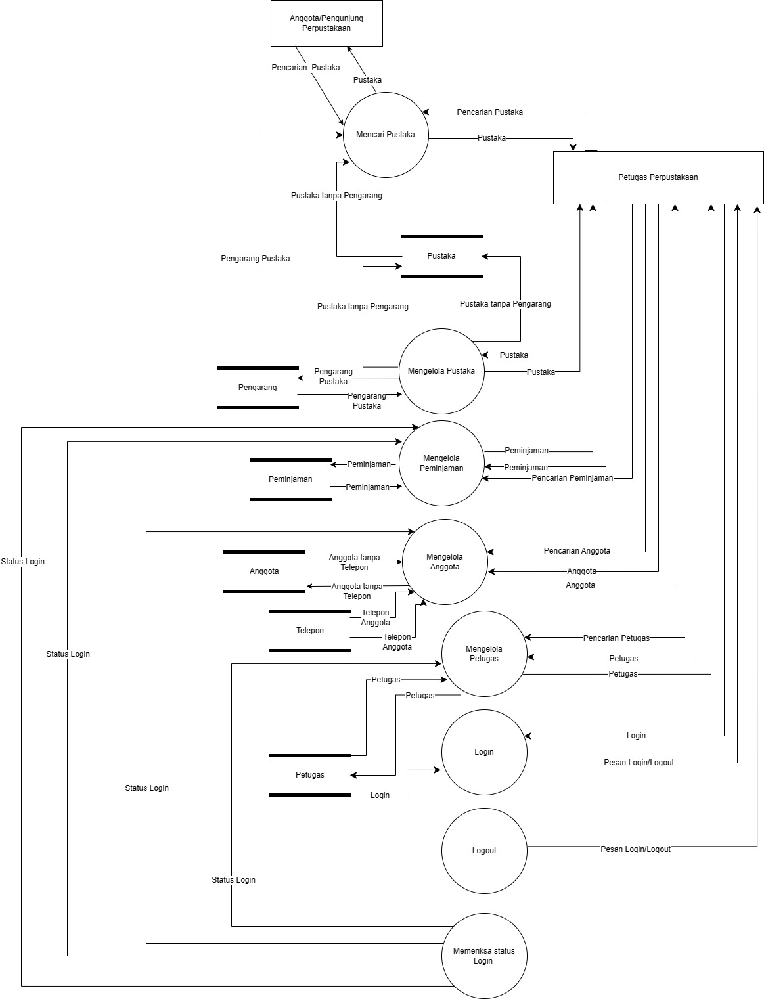
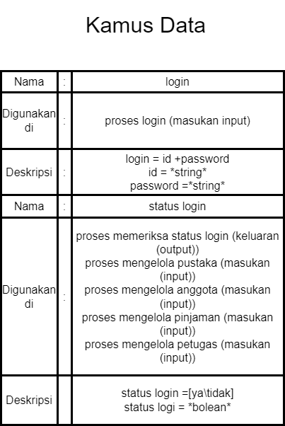

# studi-kasus-data-flow-diagram
# Nama : FADHIL HAZZA ISWADINATA

# DFD LEVEL 0

# DFD LEVEL 1

# DFD LEVEL 2(Mengelola Pustaka1)
.jpeg)

# DFD LEVEL 2(Mengelola Pustaka2)
.jpeg)

# DFD Level 2(Mengelola Anggota)
.jpeg)

# DFD LEVEL 2(Mengelola Peminjaman)
.jpeg)

# DFD LEVEL 2(Mengelola Petugas)
.jpeg)

# DFD Kamus Data

