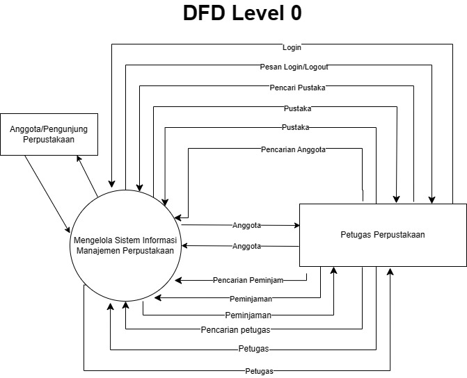
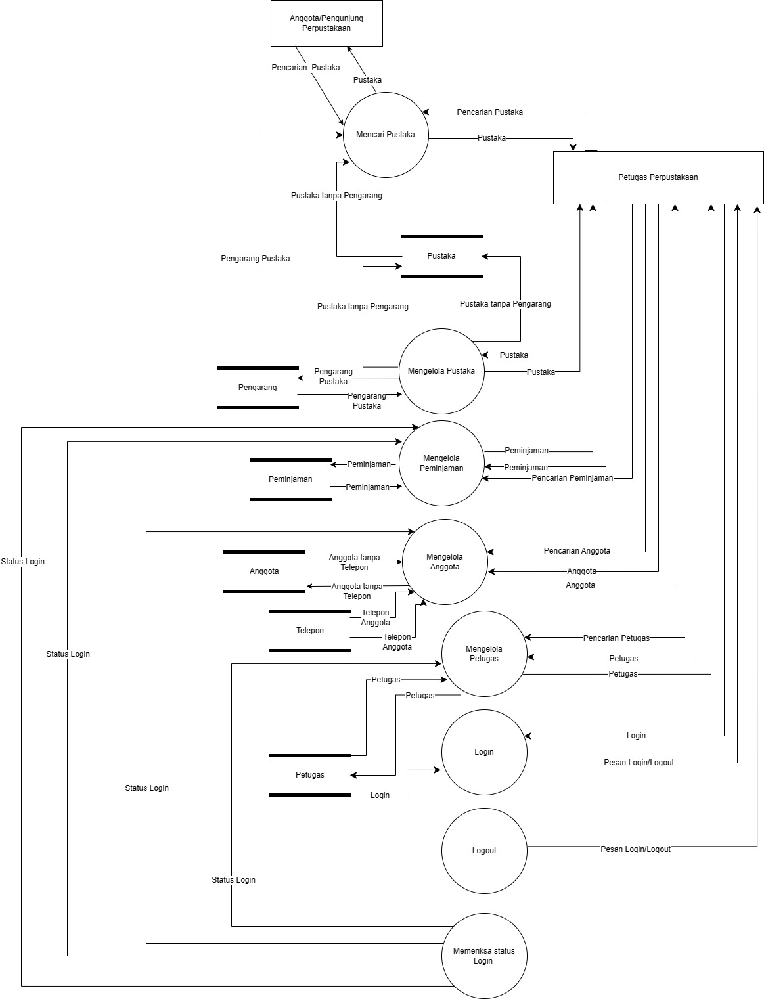

# studi-kasus-data-flow-diagram
## Dyandra
### kelompok-12

# DFD level 0
  
Anggota/Pengunjung perpustakaan 
Anggota atau pengunjung perpustakaan dapat mencari buku pada aplikasi yang dibangun, oleh sebab itu entitas ini mengirim masukan (input) berupa data pencarian untuk proses pencarian data buku dan menerima keluaran (output) berupa data buku yang dicari.
 
 
Petugas Perpustakaan 
Petugas perpustakaan merupakan entitas yang cukup banyak berinteraksi dengan sistem. Kegiatan yang bisa dilakukan diantaranya melakukan login, mencari buku, mengelola data buku, mencari peminjaman, mengelola data peminjaman, mencari anggota, mengelola data anggota, mencari petugas dan data mengelola petugas.
 
 
Aliran data dikirim dari entitas petugas yang masuk ke dalam sistem  Informasi Manajemen Perpustakaan adalah: 
-data login untuk proses login ke sistem 
-data pencarian buku untuk proses pencarian dan pengelolaan buku 
-data peminjaman untuk proses pencarian dan pengelolaan data peminjaman 
-data anggota untuk proses pencarian dan pengelolaan data anggota 
-data petugas untuk proses pencarian dan pengelolaan data petugas. 
 
 
Dari masukan yang diterima oleh sistem, selanjutnya aliran data yang keluar dari sistem Informasi Manajemen Perpustakaan ke petugas adalah: 
-Pesan login/logout dari proses login/logout 
-data buku dari proses pencarian dan pengelolaan buku 
-data peminjaman dari proses pencarian dan pengelolaan data peminjaman 
-data anggota dari proses pencarian dan pengelolaan data anggota 
-data petugas dari proses pencarian dan pengelolaan data petugas. 

# DFD level 1

# DFD level 2 (1)
.jpg)
# DFD level 2 (2)
.jpg)
# DFD level 2 (3)
.jpg)
# DFD level 2 (4)
.jpg)
# DFD level 2 (5)
.jpg)

# DFD Kamus Data
