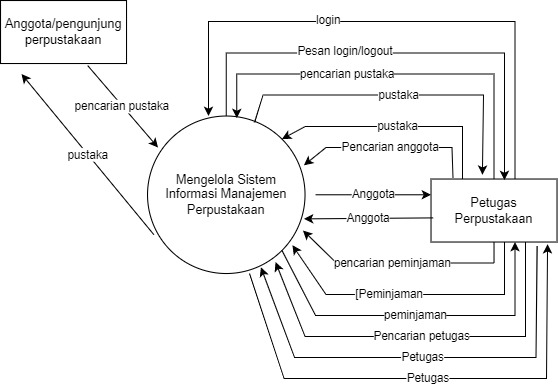
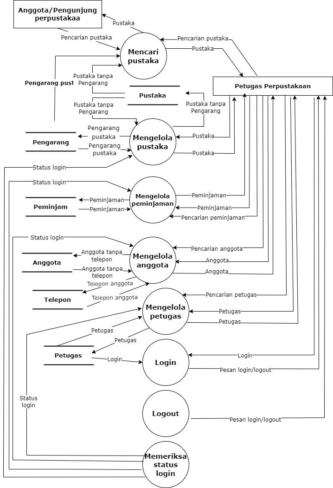
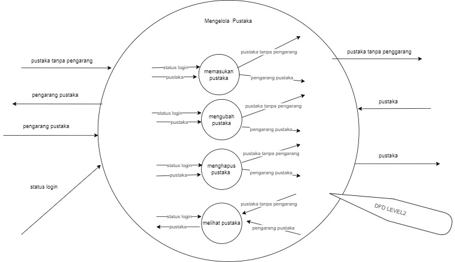
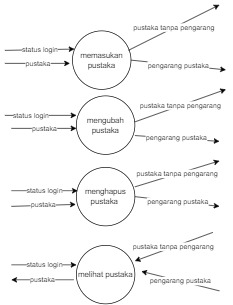
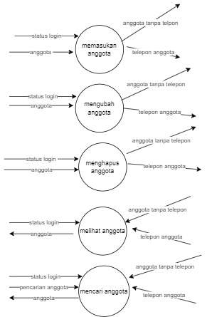
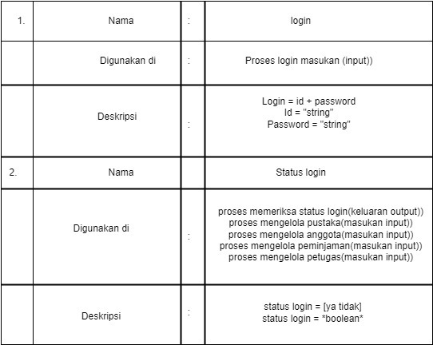

# studi-kasus-data-flow-diagram

Diagram Rafi Jara Mutiar
# DFD level 0

# DFD LEVEL 0
- anggota/ pengunjung perpustakaan melakukan pencarian Pustaka ke sistem informasi manajemen perpustakaan. 
- anggota login dahulu untuk melakukan pencarian Pustaka
- anggota mebuat pesan login 
- anggota mencari buku apa yang dia ingin kan 
- sistem mengkonfirmasi kepada petugas perpustakaan untuk menunjukkan letak di mana buku itu 
- petugas menginput buku yang di pinjem anggota 
- petugas mencari/ mencatat nama anggota untuk peminjaman buku
# DFD level 1

# DFD LEVEL 1
-setelah mencari Pustaka lalu ada beberapa bagian 
- mengelola Pustaka
- mengelola pinjaman
- mengelola anggota
- mengelola petugas
- login
- logout

- Jadi di setiap masing masing nama tersebut ada penjelasan itu tersendiri, nah penjelasan itu akan di jelaskan pada masing masing daftar nama tersebut

# DFD level 2 no 1

MENGELOLA PUSTAKA
1.pustaka tanpa pengarang mengalirkan data ke mengelola pustaka
2.mengelola pustaka mengalirkan data pengarang pustaka kepada penyimpanan data pengarang
3.pengarang pustaka mengalirkan data ke mengelola pustaka 
3.status login mengngalirkan data ke mengelola pustaka
4.menglolakan pustaka mengalirkan data pustaka tanpa pengarang kepada penyimpanan data pengarang
5.petugas mengalirkan data pustaka kepada mengelola pustaka
6. proses pemeriksaan status login mengalirkan data ststus login kepada mengelola pustaka
# DFD level 2 no 2

# PROSES MENGELOLA PUSTAKA
- Mengelola Pustaka mengenai tentang memasukan Pustaka,mengubah Pustaka ,menghapus Pustaka, dan melihat Pustaka
- 1.status login memasukkan data ke pustaka,selanjutnya mengalirkan data pustaka tanpa pengarang ke petugas
- 2.pustaka mengalirkan data ke proses memasukan pustaka, selanjutnya mengalirkan data pengarang pustaka ke petugas
- 3.status login mengalirkan data ke mengubah pustaka, selanjutnya mengalirkan data pustaka tanpa pengarang ke petugas
- 4.pustaka mengalirkan data ke proses mengubah pustaka, selanjutnya mengalirkan data pengarang pustaka ke petugas
- 5.status login mengalirkan data ke proses menghapus pustaka, selanjutnya mengalirkan data pustaka tanpa pengarang ke petugas
- 6.pustaka mengalirkan data ke proses menghapus pustaka, selanjutnya mengalirkan data pengarang pustaka ke petugas
- 7.status login mengalirkan data ke proses melihat pustaka,selanjutnya petugas mengalirkan data pustaka tanpa pengarangke proses melihat pustaka
- 8.proses melihat anggota mengalirkan data pustaka ke petugas, selanjutnya data penyimpananpetugas mengalirkan data pustaka pengarang ke proses melihat pustaka
# DFD level 2 no 3

1. status login memasukkan data ke proses anggota,selanjutnya mengalirkan data anggota tanpa telepon ke petugas

2. anggota mengalirkan data ke proses memasukkan anggota,selanjutnya mengalirkan data telepon anggota kepetugas 

3. status login mengalirkan data ke proses mengubah anggota,selanjutnya mengalirkan data anggota tanpa telepon kepetugas

4. anggota mengalirkan data ke proses mengubah anggota,selanjutnya mengalirkan data telepon anggota ke petugas

5. status login mengalirkan data ke proses menghapus anggota,selanjutnya mengalirkan data anggota  tanpa telepon ke prtugas 

6. anggota mengalirkan data ke proses menghapus anggota,selanjutnya mengalirkan data telepon anggota ke petugas

7. status login mengalirkan  data ke proses melihat anggota,selanjutnya petugas mengalirkan data anggota tanpa telepon ke proses melihat anggota

8. proses melihat anggota mengalirkan data anggota ke petugas,selanjutnya data penyimpanan petugas mengalirkan data telepon anggota ke proses anggota

9. status login mengalirkan data ke proses mencari anggota,selanjutnya petugas mengalirkan data anggota tanpa telepon ke proses mencari anggota

10. pencarian anggota mengalirkan data ke proses mencari anggota

11. proses mencari anggota mengalirkan data anggota ke petugas,selanjutnya data penyimpan petugas mengalirkan data telepon anggota ke proses mencari anggota
# DFD level 2 no 4

1. status login memasukan data ke proses memasukkan peminjaman
2. data peminjaman mengalirkan data peminjaman ke proses memasukkan peminjaman
3. proses memasukkan peminjaman mengalirkan data peminjaman kepada petugas
4. status login memasukkan data ke proses mengubah peminjaman
5. data peminjaman mengalirkan data peminjaman ke proses mengubah peminjaman
6. proses mengubah peminjaman mengalirkan data peminjaman kepada petugas
7. status login memasukkan data ke proses menghapus peminjaman
8. data peminjaman mengalirkan data peminjaman ke proses menghapus pemijaman
9. proses menghapus peminjaman mengalirkan data peminjaman kepada petugas
10. status login memasukkan data ke proses melihat peminjaman
11. proses mengalirkan data peminjaman ke penyimpanan data peminjaman
12. petugas mengalirkan data peminjaman ke proses melihat peminjaman
13. status login memasukkan data ke proses mencari peminjaman
14. peminjaman mengalirkan data pencarian peminjaman ke mencari peminjaman
15. proses mengalirkan data peminjaman ke penyimpanan data peminjaman
16. petugas mengalirkan data peminjaman ke proses mencari peminjaman
# DFD level 2 no 5

 1. Status  login memasukan data ke proses memasukan petugas 
    2. data petugas mengalirkan data petugas ke proses memasukan petugas
	3 proses memasukan petugas mengalirkan data petugas kepada petugas
	
	1 status login memasukan data ke proses mengubah petugas
	2 data petugas mengalirkan data petugas ke proses mengubah petugas
	3 proses mengubah petugas mengalirkan data petugas ke petugas
	
	1 status login memasukan data ke proses menghapus petugas
	2 data petugas mengalirkan data petugas ke peroses menghapus petugas
	3 proses menghapus data petugas mengalirkan data ke petugas
	
	1 status login memasukan data ke proses ke melihat petugas
	2 proses data mengalirkan data petugas ke petugas
	3 petugas mengalirkan data petugas ke mnelihat petugas
	
	1 status login memasukan data ke proses mencari petugas
	2 petugas mengalirkan data pencarian petugas ke mencari petugas
	3 proses mengalirkan data petugas ke  penyimpanan data petugas
	4 petugas mengalirkan data petugas ke   proses mencari petugas
 -anggota/pengunjung perpustakaan melakukan pencarian terhadap daftar pustaka
-sistem mencari pustaka menerima data tersebut dan memberikan daftar pustaka kepada pengunjung/anggota
-mencari pustaka menerima data pengunjung/anggota yang mencari pustaka, kemudian mengirimkan data pustaka kepada petugas 
-petugas perpustakaan mendapatkan data pustaka, dan memberikan pencarian daftar pustaka kepada mencari pustaka 
-mengelola pustaka memberikan pustaka tanpa pengarang kepada pustaka
- pustaka memberikan data pustaka tanpa pengarang kepada mencari pustaka 
- sistem informasi harus memeriksa terlebih dahulu memeriksa situs login dari mengelola pustaka, untuk dapat mengubah data dari mengelola pustaka
- jika sudah login, pustaka dapat memberikan beberapa data pustaka tanpa pengarang kepada mengelola pustaka
- mengelola pustaka memberi data tersebut kepada pengarang
- pengarang memberika data pengarang pustaka kepada mengelola pustaka
- mengelola pustaka memberikan data pustaka kepada petugas
- petugas menerima data pustaka tersebut dan memproses kepada mencari pustaka lewat pencarian pustaka 
- pengarang memasukkan pengarang pustaka kepada mencari pustaka
- mencari pustaka memproses data keduanya untuk di berikan kepada anggota/pengunjung
- petugas perpustakaan memberikan data pencarian peminjaman kepada mengelola peminjaman 
- petugas perpustakaan memberikan data peminjaman yang di pinjam oleh anggota/pengunjung 
- sistem informasi harus terlebih dahulu memeriksa status login untuk dapat menjangkau mengelola peminjaman untuk di lakukan peminjaman 
- jika sudah status login, mengelola peminjaman menerima dan memberikan data kepada sistem peminjaman
- sistem peminjaman menerima data dan memberikan kembali kepada mengelola peminjaman, tanda peminjaman di perbolehkan
- kemudian memberikan data peminjaman kepada petugas untuk di berikan kepada mencari pustaka kemudian anggota/pengunjung
- petugas melakukan pencarian terhadap data anggota
- petugas kemudian memberikan data anggota yang di cari
- sistem informasi mengecek status login terlebih dahulu untuk dapat menjangkau sistem mengelola petugas
- jika sudah berstatus login, maka sistem mengelola anggota akan memberikan data anggota tanpa telepon kepada anggota
- anggota menerima data dan memberikan data anggota tanpa telepon kepada sistem mengelola anggota
- mengelola anggota memberikan data telpon anggota kepada telpon
- telpon menerima data dan memberikan data telpon anggota ke mengelola anggota 
- mengelola anggota menerima data telpon anggota dan memberikan data kepada petugas
-petugas melalukan pencarian data petugas lainnya kepada mengelola tugas
-petugas memberika data anggota yang di cari
- sistem memeriksa status login dari petugas perpustakaan 
- jika sudah berstatus login, mengelola petugas akan mencari data petugas kepada petugas
- petugas memberikan data petugas yang di cari
- kemudian mengelola petugas menerima data dan memberikannya kepada petugas perpustakaan 
- petugas perpustakaan melakukan login 
- sistem login menerima data login petugas perpustakaan
- sistem petugas menerima login petugas perpustakaan
- sistem login kemudian memberikan pesan login/logout kepada petugas perpustakaan
- jika login terdapat, berarti petugas bisa menjalankan tugasnya
- jika logout maka petugas harus login kembali
# kamusdata rapi

