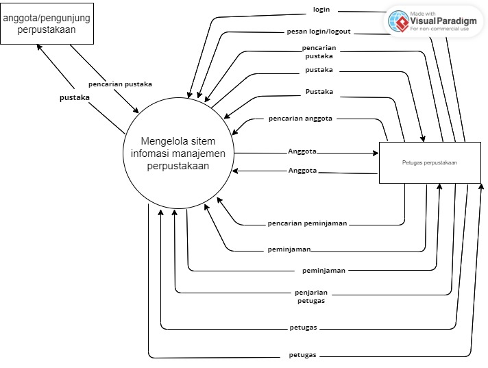
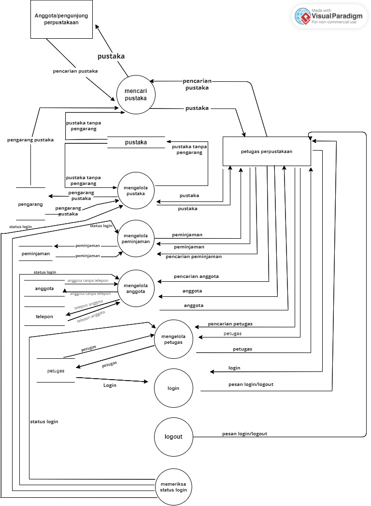
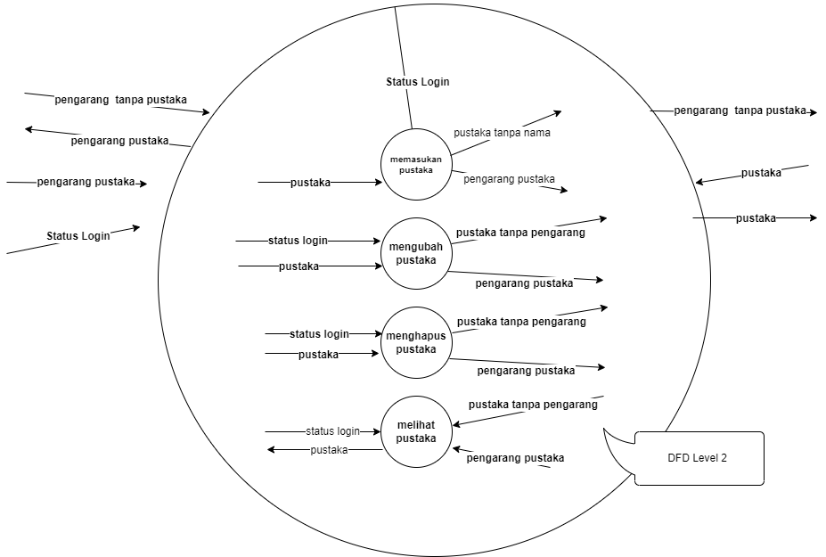
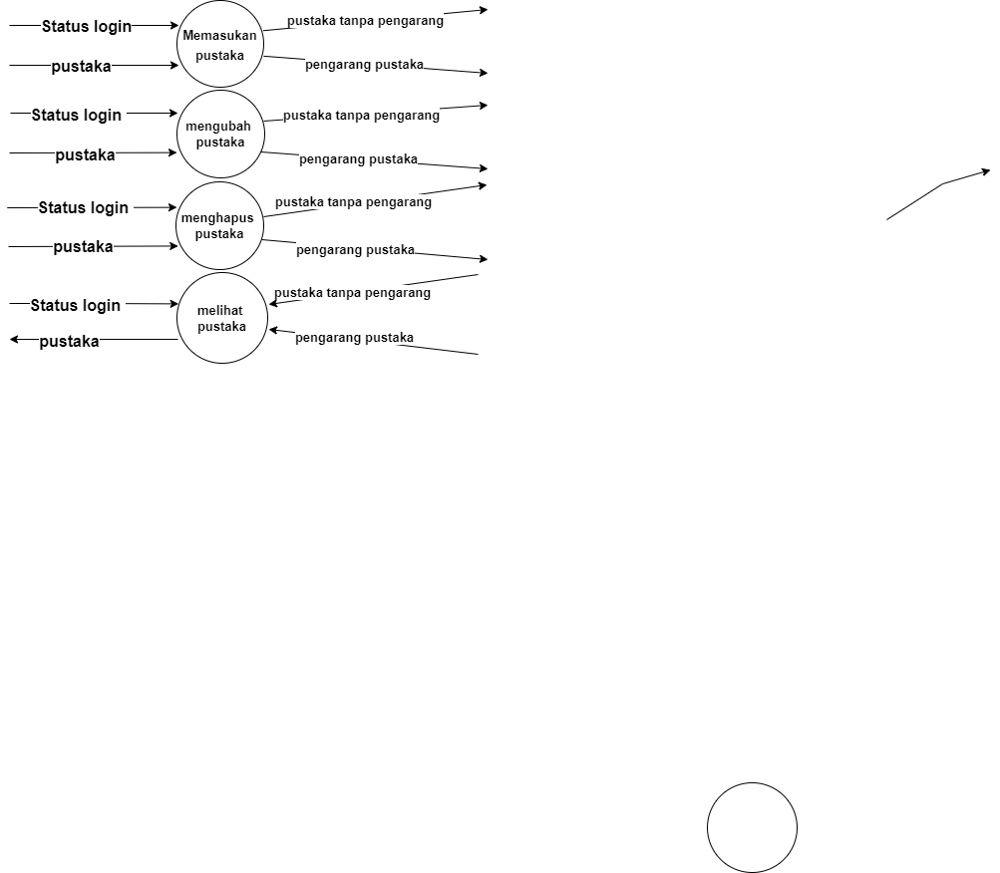
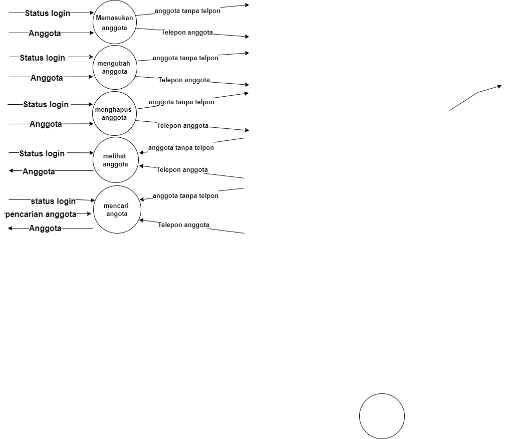
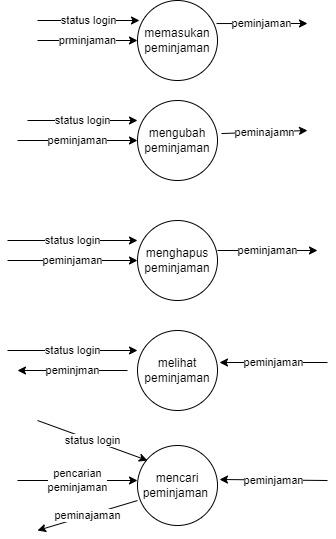
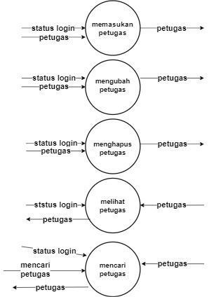
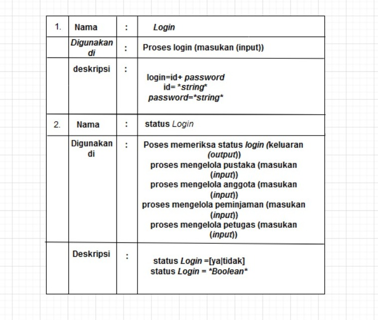

# studi-kasus-data-flow-diagram
# dfd level 0

\
Jadi dari proses mengelola sistem informasi manajemen perpustakaan trus ada aliran data yang dikirim dari proses ke masukan (input)atau keluaran (output) seperti pada gambar DFD level 0 ada anggota atau pengunjung perpustakaan pencarian pustaka ke  mengelola sistem informasi manajemen perpustakaan lalu pencarian pustaka  pustaka dari petugas diproses di  mengelola sistem informasi manajemen perpustakaan lalu dikirimkan ke pengunjung perpustakaan lalu petugas, pencarian anggota ke proses lalu dikirim ke petugas perpustakaan lalu di proses lagi trus pencarian peminjaman  ke proses pengelolaan sistem informasi manajemen perpustakaan peminjaman dikirm ke proses lalu di kirim ke petugas perpustakaan pencarian petugas petugas dikirim ke proses mengelola sistem informasi manajemen perpustakaan lalu petugas dikirim lagi ke petugas perpustakaan.
\
# dfd level 1

\
Lalu setelah DFD level 0 DFD level satu,merupakan hasil break down dari DFD level 0 yang sebelumnya dibuat,,adapun juga status login dia login sebagai petugas atau pengunjung perpustakaan , pengunjung perpustakaan pencarian pustaka lalu di proses dikirim ke petugas perpustakaan lagi di proses di pengelola pustaka ada beberapa proses di dalam mengelola pustaka ada pustaka tanpa pengarang jadi di proses lagi di kirim ke pengarang pustaka lalu di proses dan dikirim ke pengunjung perpustakaan lalu pengunjung ingin meminjam bukunya jadi diproses memalui mengelola pinjaman lalu proses mengelola anggota seperti meminta nomor telpon nya ke pada anggota jika mau meminjam bukunya setelah itu pencarian petugas proses mengelola petugas petugas login jika sudah logout
\
# dfd level 2 no1

\
Selanjutnya DFD level 2
di dalam mengelola pustaka ada  pustaka tanpa pengarang yang akan di proses di mengelola pustaka ada beberapa proses di dalam mengelola pustaka seperti memasukan pustaka mengubah pustaka menghapus pustaka melihat pustaka
\
# dfd level 2 no2

\
Selanjutnya DFD level 2 - (mengelola pustaka) 
Ada beberapa proses yaitu memasukan pustaka setelah itu mengubah nya setelah itu merefisi atau menghapus pustaka jika sudah selesai melihat di chek lagi pustaka nya
\
# dfd level 2 no3

\
## Selanjutnya DFD level 2 -(mengelola anggota)
ada beberapa proses dalam mengelola anggota yaitu memasukan anggota memasukkan telpon anggota selanjutnya mengubah nya selanjutnya menghapus anggota melihat anggota atau mengecek kembali apakah ada yang harus diperbaiki jika memang sudah selesai selanjutnya mencari anggota
# dfd level 2 no4

\
## Selanjutnya DFD level 2 (mengelola peminjaman)
\
ada beberapa proses yang pertama memasukkan peminjaman atau buku apa yang akan di pinjaman lalu di proses selanjutnya mengubah peminjaman jika ingin mengubah buku yang ingin di pinjam selanjutnya menghapus peminjaman selanjutnya melihat siapa yang meminjam setelah itu mencari peminjam
\
# dfd level 2 no5

\
## Selanjutnya DFD level 2 - (mengelola petugas)
\
Status login sebagai petugas masukkan petugas selanjutnya mengubah petugas selanjutnya melihat petugas selanjutnya mencari petugas
\
# Kamus Data 

\
## Kamus Data
\
Nama dari datanya adalah login 
,lalu proses login masukan (input) seperti id dan password lalu status login lalu proses memeriksa status login keluaran (output) masukkan (input) akan memeriksa login sebagai apa, apakah petugas atau anggota, selanjutnya status login ya atau tidak.