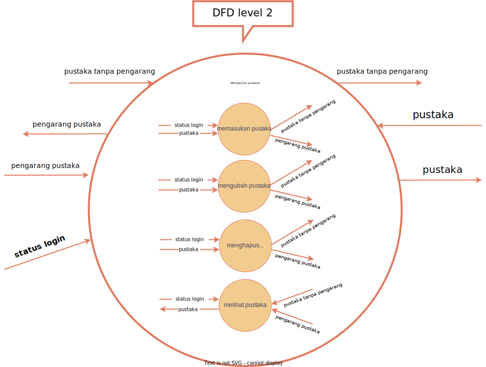
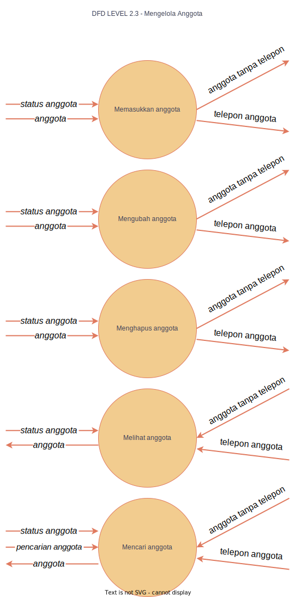
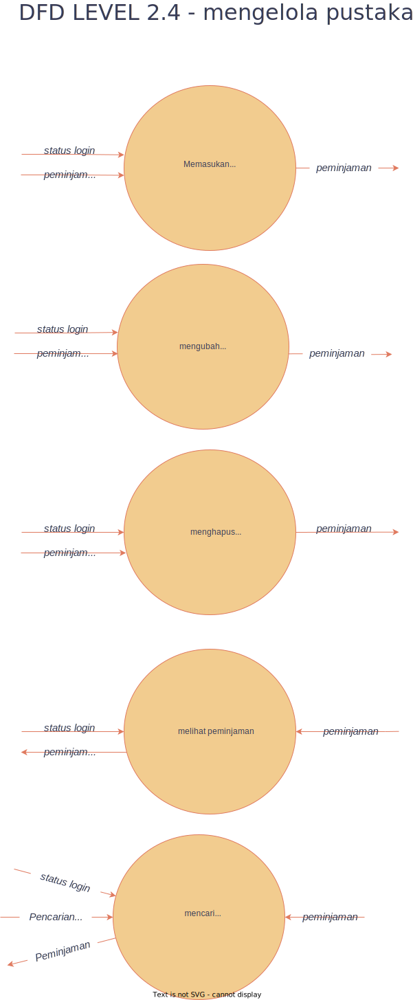
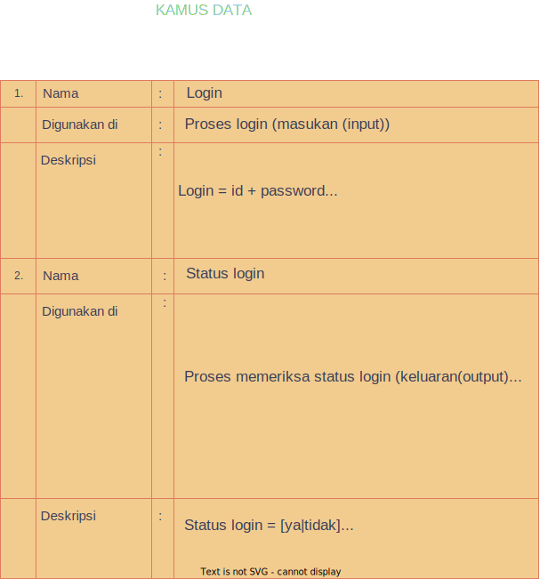

# studi-kasus-data-flow-diagram

- Nama  : Achmad Firdaus Thesar
- Kelas : X PPLG 1
- Kelompok : 3

<i>Dibawah ini adalah sebuah Diagram</i>

# Ini hasil dari DFD dan Kamus Datanya~

### DFD LVL 0

### DFD LVL 1
[

### DFD LVL 2.1

### DFD LVL 2.2

### DFD LVL 2.3

### DFD LVL 2.4

### DFD LVL 2.5

### Kamus Data
