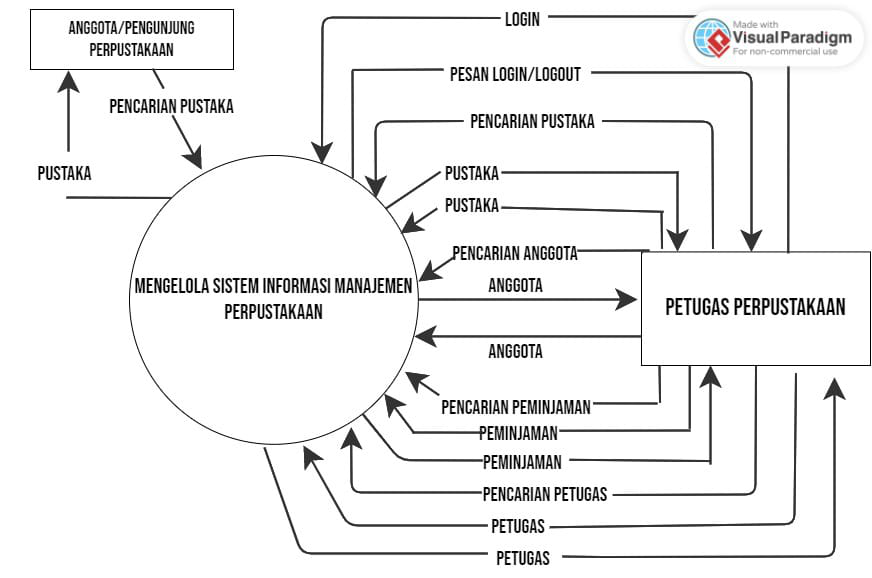
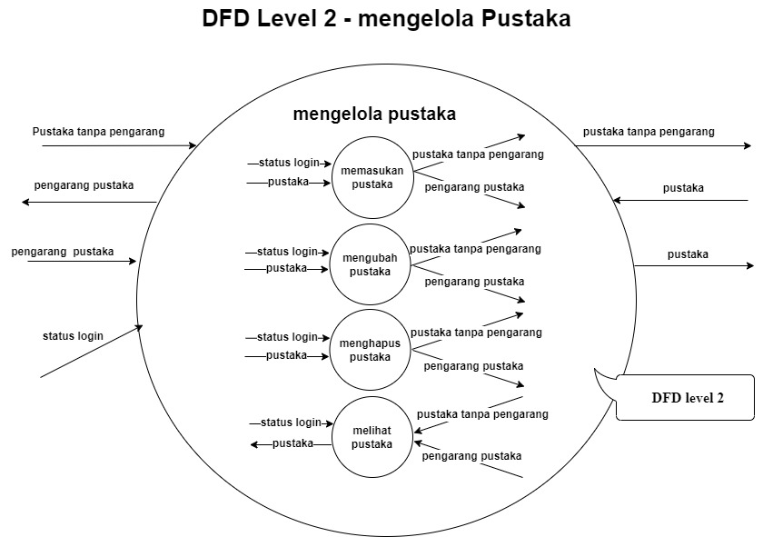
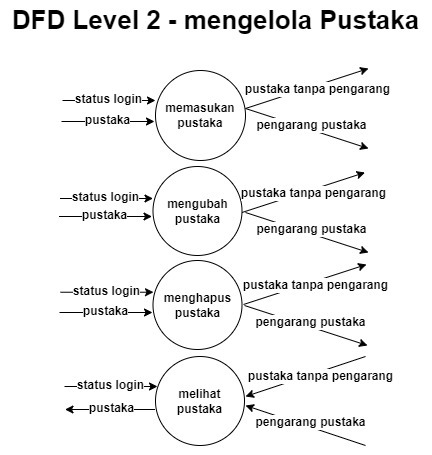
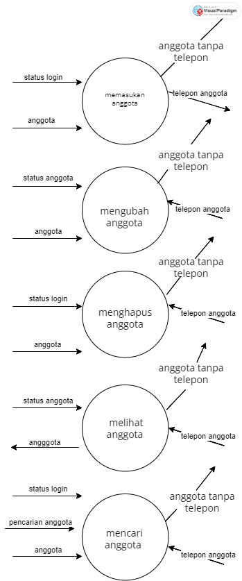
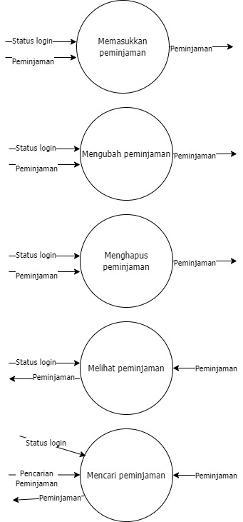
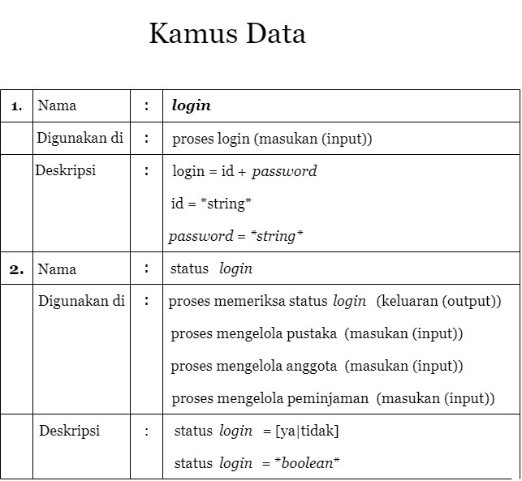

# Fajril Yusin Supriadi

# Level0
[

Terdapat 2 Aktor yang terlibat yaitu;
 [Anggota/Pengunjung perpustakaan] 
 Anggota/Pengunjung Perpustakaan adalah Seorang Anggota atau pengunjung yang ingin meminjam ke perpustakaan.  
 [Petugas Perpustakaan] 
 Petugas Perpustakaan adalah seorang petugas yang memenuhi permintaan/pinjaman dari pengunjung yang sudah di proses dan sudah mendapat izin dari sistem yang mengelola informasi manajemen perpustakaan.  
 (Mengelola sistem informasi manajemen perpustakaan)  
 Sistem yang mengelola permintaan anggota dan memenuhi permintaan anggota yang di dapatkan dari petugas.  
 Penjelasan komponen-komponen DFD level 0: 
 •Petugas perpustakaan melakukan login;  
 •Dan sistem informasi akan memberikan notif/pesan kepada petugas perpustakaan;  
 •Petugas perpustakaan mengirim pencarian pustaka ke sistem informasi;  
 •Anggota/pengunjung mencari sebuah buku yang akan dipinjam, dan akan diterima sistem informasi;  
 •Sistem informasi memberikan data pustaka pada petugas perpustakaan;  
 •Petugas perpustakaan memberikan data buku yang dicari pengunjung ke sistem informasi;  
 •Petugas perpustakaan mencari data anggota/pengunjung yang ingin meminjam tersebut di database sistem informasi;  
 •Sistem informasi memberikan data anggota/pengunjung yang ingin meminjam buku pada petugas perpustakaan;  
 •Petugas perpustakaan memberikan akses untuk anggota/pengunjung;  
 •Petugas perpustakaan melakukan pencarian peminjaman di sistem informasi;  
 •Petugas perpustakaan memberikan formulir peminjaman pada sistem informasi untuk diisi tanggal,buku yg dipinjam,dll;  
 •Lalu sistem memberikan data peminjaman tersebut ke petugas perpustakaan;  
 •Selanjutnya tahap mencari data petugas yang akan melayani peminjaman tsb;  
 •Petugas memberikan akses untuk memberikan buku yang akan dipinjam;  
 •Sistem informasi memberikan konfirmasi pada petugas perpustakaan;  
 •Sistem memberikan data pustaka pada anggota/pengunjung perpustakaan; 
# level1
[

# level2
[

# Level2 Mengelola Pustaka
[

# Level 2 Mengelola Anggota
[

# Level2 Mengelola Peminjaman
[

# Level2 Mengelola Petugas
[.png)

# Kamus Data
[
