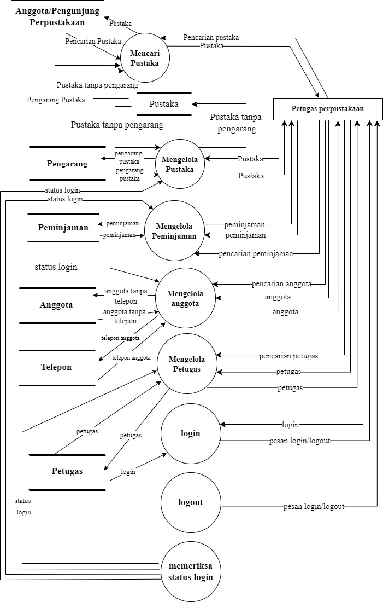

# Fajril Yusin Supriadi

# Level 0
[

<i>Terdapat 2 Aktor yang terlibat yaitu;
 [Anggota/Pengunjung perpustakaan] 
 Anggota/Pengunjung Perpustakaan adalah Seorang Anggota atau pengunjung yang ingin meminjam ke perpustakaan.  
 [Petugas Perpustakaan] 
 Petugas Perpustakaan adalah seorang petugas yang memenuhi permintaan/pinjaman dari pengunjung yang sudah di proses dan sudah mendapat izin dari sistem yang mengelola informasi manajemen perpustakaan.  
 (Mengelola sistem informasi manajemen perpustakaan)  
 Sistem yang mengelola permintaan anggota dan memenuhi permintaan anggota yang di dapatkan dari petugas.  
 Penjelasan komponen-komponen DFD level 0: 
 •Petugas perpustakaan melakukan login;  
 •Dan sistem informasi akan memberikan notif/pesan kepada petugas perpustakaan;  
 •Petugas perpustakaan mengirim pencarian pustaka ke sistem informasi;  
 •Anggota/pengunjung mencari sebuah buku yang akan dipinjam, dan akan diterima sistem informasi;  
 •Sistem informasi memberikan data pustaka pada petugas perpustakaan;  
 •Petugas perpustakaan memberikan data buku yang dicari pengunjung ke sistem informasi;  
 •Petugas perpustakaan mencari data anggota/pengunjung yang ingin meminjam tersebut di database sistem informasi;  
 •Sistem informasi memberikan data anggota/pengunjung yang ingin meminjam buku pada petugas perpustakaan;  
 •Petugas perpustakaan memberikan akses untuk anggota/pengunjung;  
 •Petugas perpustakaan melakukan pencarian peminjaman di sistem informasi;  
 •Petugas perpustakaan memberikan formulir peminjaman pada sistem informasi untuk diisi tanggal,buku yg dipinjam,dll;  
 •Lalu sistem memberikan data peminjaman tersebut ke petugas perpustakaan;  
 •Selanjutnya tahap mencari data petugas yang akan melayani peminjaman tersebut;  
 •Petugas memberikan akses untuk memberikan buku yang akan dipinjam;  
 •Sistem informasi memberikan konfirmasi pada petugas perpustakaan;  
 •Sistem memberikan data pustaka pada anggota/pengunjung perpustakaan; </i>
# level 1
[

<i>•Anggota mencari pustaka ke sistem dan petugas perpustakaan mencari pustaka di sistem dan mengirimnya ke petugas perpustakaan

  •Lalu Petugas perpustakaan login dan sistem memberikan pesan login 

•Sistem memeriksa sistem login 

  •Petugas perpustakaan mencari data pustaka di sistem dan sistem mencari data pustaka di storage pustaka 

  •Dan Petugas perpustakaan mencari data peminjaman di sistem dan sistem mencari data peminjaman di storage peminjaman 

  •Petugas perpustakaan mencari data anggpta di sistem dan sistem mencari data anggota tanpa telepon di storage anggota dan mencari data telepon anggota di storage telepon 

  •Terakhir Petugas perpustakaan mencari data petugas di sistem dan sistem mencari data di storage petugas<i/>

# level 2
[

<i>•Sistem yang mengelola proses memasukan pustaka, mengubah pustaka, menghapus pustaka, dan melihat pustaka  

 •Pustaka tanpa pengarang- Proses memberikan data data pustaka tanpa pengarang yang ingin dimasukkan ke proses  mengelola pustaka  

 •Pengarang pustaka- Proses memberikan data data pengarang pustaka yang ingin dimasukkan ke proses mengelola pustaka  

 •Status login- Proses mengambil dan mengecek data status login dari proses sebelumnya  

 •Pustaka tanpa pengarang- Proses memberikan data data pustaka tanpa pengarang yang ingin dimasukkan ke proses selanjutnya  

 •Pustaka- Proses mengirim data pustaka yang ingin dimasukkan ke proses selanjutnya  

 •Pustaka- Proses mengirim data pustaka yang ingin dimasukkan ke proses mengelola pustaka  

 •Pengarang pustaka- Proses menunjukan data data pengarang pustaka yang diambil dari proses mengelola pustaka </i>

# Level 2 Mengelola Pustaka
[

<i>•Status login- Proses mengambil dan mengecek data status login dari proses sebelumnya  

 -Pustaka- Proses mengambil data pustaka yang ingin dimasukkan  

 •Pustaka tanpa pengarang- Proses memberikan data data pustaka tanpa pengarang yang ingin dimasukkan  

 •Pengarang pustaka- Proses memeberikan data data pengarang pustaka yang ingin dimasukkan  

 Proses Mengubah pustaka:  

 •Status login- Proses mengambil dan mengecek data status login dari data sebelumnya  

 •Pustaka- Proses mengambil data pustaka yang ingin diubah  

 •Pustaka tanpa pengarang- Proses memberikan data data pustaka tanpa pengarang yang ingin diubah  

 •Pengarang pustaka- Proses memberikan data data pengarang pustaka yang ingin diubah  

 Proses Menghapus pustaka:  

 •Status login- Proses mengambil dan mengecek data status login dari proses sebelumnya  

 •Pustaka- Proses mengambil data pustaka yang ingin dihapus  

 •Pustaka tanpa pengarang- Proses memberikan data data pustaka tanpa pengarang yang ingin di hapus  

 •Pengarang pustaka- Proses memberikan data data pengarang pustaka yang ingin di hapus  

 Proses Melihat pustaka:  

 •Status login- Proses mengambil dan mengecek data status login dari proses sebelumnya  

 •Pustaka- Proses memberikan data pustaka yang ingin dilihat  

 •Pustaka tanpa pengarang- Proses mengambil data pustaka tanpa pengarang yang ingom di lihat  

 •Pengarang pustaka- Proses mengambil data pengarang pustaka yang ingin di lihat </i>

# Level 2 Mengelola Anggota
[

<i>•Status login- Proses mengambil dan mengecek data status login dari data sebelumnya  

 •Anggota- Proses mengambil data anggota yang ingin dimasukkan  

 •Anggota tanpa telepon- Proses mengirim data data anggota tanpa telepon yang ingin di masukkan  

 •Telepon anggota- Proses mengirim data data telepon anggota yang ingin di masukkan  

 Proses Mengubah anggota:  

 •Status login- Proses mengambil dan mengecek data status login dari data sebelumnya  

 •Anggota- Proses mengambil data anggota yang ingin di ubah 

 •Anggota tanpa telepon- Proses mengirim data anggota tanpa telepon yang ingin di ubah  

 •Telepon anggota- Proses mengirim data telepon anggota yang ingin di ubah  

 Proses Menghapus anggota:  

 •Status login- Proses mengambil dan mengecek data status login dari data sebelumnya  

 •Anggota- Proses mengambil data anggota yang ingin di hapus  

 •Anggota tanpa telepon- Proses mengirim data tanpa telepon yang ingin di hapus  

 •Telepon anggota- Proses mengirim data telepon anggota yang ingin dihapus  

 Proses Melihat anggota:  

 •Status login- Proses mengambil dan mengecek data status login dari data sebelumnya  

 •Anggota- Proses mengirim data pustaka yang ingin dilihat  

 •Anggota tanpa telepon- Proses mengambil data anggota tanpa telepon yang ingin dilihat  

 •Telepon anggota- Proses mengambil data anggota tanpa telepon yang ingin dilihat  

 Proses Mencari anggota:  

 •Status login- Proses mengambil dan mengecek data status login dari data sebelumnya  

 •Pencarian anggota- Proses mengambil dan mengecek data anggota yang ingin dicari  

 •Anggota- Proses mengirim data anggota yang dicari  

 •Anggota tanpa telepon- Proses mengambil data anggota tanpa telepon yangg dicari  

 •Telepon anggota- Proses mengambil data telepon anggota yang dicari </i>

# Level 2 Mengelola Peminjaman
[

<i>•Status login- Proses mengambil dan mengecek data status login dari data sebelumnya  

 •Peminjaman- Proses mengambil dan mengirim data peminjaman yang ingin dimasukkan  

 Proses Mengubah peminjaman:  

 •Status login- Proses mengambil dan mengecek data status login dari data sebelumnya  

 •Peminjaman- Proses mengambil dan mengirim data peminjaman yang ingin diubah  

 Proses Menghapus peminjaman:  

 •Status login- Proses mengambil dan mengecek data status login dari data sebelumnya  

 •Peminjaman- Proses mengambil dan mengirim data peminjaman yang ingin dihapus  

 Proses Melihat peminjaman:  

 •Status login- Proses mengambil dan mengecek data status login dari data sebelumnya  

 •Peminjaman- Proses mengambil dan mengirim data peminjaman yang ingin dilihat  

 Proses Mencari peminjaman:  

 •Status login- Proses mengambil dan mengecek data status login dari data sebelumnya  

 •Pencarian peminjaman- Proses mengambil data peminjaman yang di cari  

 •Peminjaman- Proses mengambil dan mengirim data peminjaman yang di cari </i>

# Level 2 Mengelola Petugas
[.png)

<i>•Status login- Proses mengambil dan mengecek data status login dari data sebelumnya  

 •Petugas- Proses mengambil dan mengirim data petugas yang ingin dimasukkan  

 Proses Mengubah Petugas:  

 •Status login- Proses mengambil dan mengecek data status login dari data sebelumnya  

 •Petugas- Proses mengambil dan mengirim data petugas yang ingin diubah  

 Proses Menghapus Petugas:  

 •Status login- Proses mengambil dan mengecek data status login dari data sebelumnya  

 •Petugas- Proses mengambil dan mengirim data petugas yang ingin dihapus  

 Proses Melihat Petugas:  

 •Status Login- Proses mengambil dan mengecek data status login dari data sebelumnya  

 •Petugas- Proses mengambil dan mengirim data petugas yang ingin dilihat  

 Proses Mencari Petugas:  

 •Status login- Proses mengambil dan mengecek data status login dari data sebelumnya  

 •Mencari petugas- Proses mengambil data petugas yang dicari  

 •Petugas- Proses mengambil dan mengirim data petugas yang dicari </i>

# Kamus Data
[
