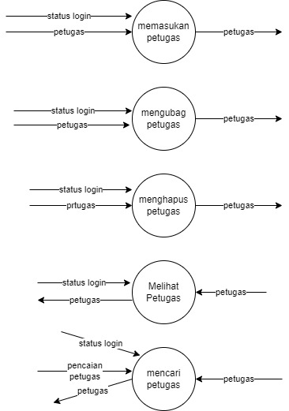

# studi-kasus-data-flow-diagram
# dfd level 0

*si pengunjung melakukan pencarian pustaka di sistem informasi
 manajemen perpus. 
*sistem memberitahukan si admin agar login ke sistem manajemen
 perpus. 
*lalu si sistem memberikan pesan ke admin bahwa admin sudah login 
 ke sistem manajemen perpus. 
*lalu admin perpus masuk ke dalam sistem manajement perpus. 
*setelah login admin perpus melakukan pencarian daftar pustaka
 dari daftar perpus yg di cari oleh pengunjung. 
*lalu sistem memberikan pustaka yg dicari oleh admin. 
*lalu admin mencarikan seorang yg berada di sistem perpus
 untuk mencari pustaka yg di cari oleh pengunjung. 
*sistem meminta izin akses peminjaman yg diminta oleh pengunjung perpus. 
*lalu admin memberikan akses peminjman kepada sistem untuk meminjmkan buku 
 kepada pengunjung. 
*admin melakukan pencarian peminjaman di sistem. 
*lalu admin melakukan pencarian anggota yg meminjam pustaka. 
*apa bila sudah ketemu sistem memberikan pustaka yg dicari oleh pengunjung 
  atas izin admin. 
# dfd level 1

# dfd level 2 no1

# dfd level 2 no2

# dfd level 2 no3

# dfd level 2 no4

# dfd level 2 no5

# Kamus Data 
