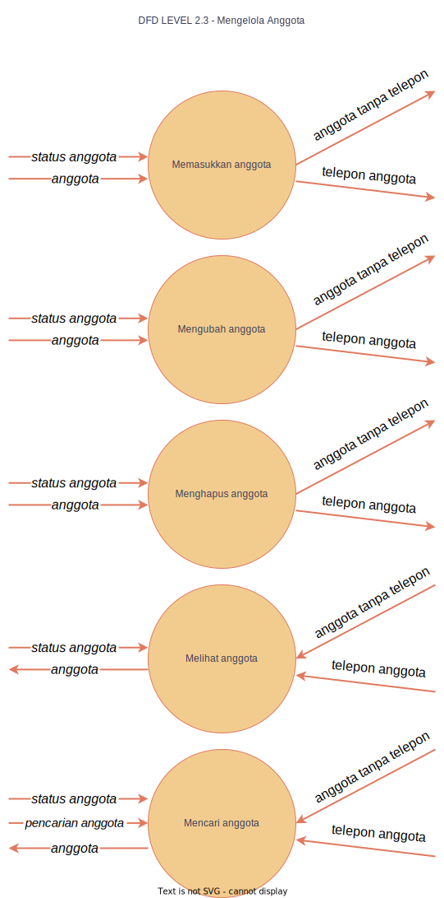

### DFD LVL 0

 
Penjelasan berbagai komponen pada DFD diatas adalah sebagai berikut:
- pada tahapan awal Anggota/pengunjung adalah memasukan informasi pribadi berupa nama, nomor Handphone, dan email.
- kemudian sistem akan mengirimkan pesan login kepada petugas dan akan dikirimkan oleh petugas menjadi akun untuk previlege anggota dan dikirimkan kepada Pengelola 
sistem informasi Manajemen perpustakaan kemudian data Anggota akan disimpan sehingga akan memudahkan Anggota untuk melakukan peminjaman atau pencarian.
- tahapan anggota mencari buku ke sistem(buku IPS),kemudian pencarian tersebut diterima oleh petugas dan petugas mengirimkan list buku(IPS) dan anggota memilih buku yang di inginkan kemudian petugas mencari anggota yang menginginkan buku(IPS) tersebut, lalu petugas mengirimkan data buku tersebut ke sistem dan sistem mengirimkan datanya ke anggota.
- tahapan anggota mencari buku dan meminjam, pada tahapan ini sistem akan mengirimkan pesan login kepada petugas perpustakaan dan mengirimkan kembali data login dari petugas ke sistem informasi, di mengelola sistem perpus anggota ke pustaka dan pencarian peminjaman berupa buku dan mencarinya dalam pustaka lalu akan dikirim ke sistem kemudian anggota akan memasukannya kedalam peminjaman yang akang di terima oleh petugas perpustakaan. lalu sistem akan meminta data berupa data anggota dan petugas dan akan disimpan ke sistem mengelola perpustakaan dan lalu dikirimkan kembali kepada anggota.
___
### DFD LVL 1

 
penjelasan berbagai komponen pada DFD diatas adalah sebagai berikut:
- DFD di atas adalah penggambaran proses yang dilakukan oleh sistem untuk petugas dan anggota, proses didalamnya meliputi mengelola pustaka, mengelola peminjaman, melakukan mengelola anggota, petugas dan data, dan data login dan logout, melakukan pemeriksaaan status login
- disini adalah tahapan anggota mencari pustaka dan peminjaman buku, ditahap pertama ini sistem mencari pustaka akan meminta data pustaka kepada petugas perpustakaan, dan ditahap ini petugas perpustakaan akan mengirimkan beberada data kepada mengelola pustaka, jika anggota mencari pustaka tanpa pengarang maka akan data tersebut akan dikirim kedalam storage pustaka, dan pustaka tanpa pengarang langsung kembali kesistem utama. dan jika anggota mencari pustaka berupa pengarang, makan sistem akan mengirimkan kepada storage pengarang dan pencarian baru akan dikirimkan ke sistem utama. tahap selanjutnya adalah petugas perpustakaan sistem mengirimkan data berupa login petugas yang kemudian memasukan data data petugas dan memeriksa status loginnya lalu tahap kemudian sistem memeriksa status login pada mengelola anggota yang akan meminjam buku pada perpustakaan dengan mengambil data anggota telepon di storage telepon dan lalu dikirimkan kembali ke mengelola petugas dan kemudian dikirimkan kepada sistem utama dan lalu terakhir kepada anggota.
___
### DFD LVL 2.1

 
penjelasan berbagai komponen pada DFD diatas adalah sebagai berikut:
- tahapan ini adalah tahapan untuk previlege petugas, di tahap ini data yang akan masuk seperti buku pustaka tanpa pengarang dan buku terdapat pengarang pusta pada mengelola pustaka akan bisa diubah dengan previlege yang khusus petugas, seperti Memasukan pustaka, Mengubah pustaka, Menghapus pustaka dan terlebih melewati dengan pengecekan status login agar dapat melakukan hal tersebut. lalu data terakhir tersebut bisa dikembalikan ke sistem lainnya. 
- tahap ini bisa diakses oleh privilege yang dimiliki anggota yaitu dengan melihat pustaka dengan melewati fase status login dan pustaka tanpa pengarang dan pengarang pustaka pada laman melihat pustaka.
___
### DFD LVL 2.2

 
penjelasan berbagai komponen pada DFD diatas adalah sebagai berikut:
- pada tahapan ini terdapat 2 previlege yaitu anggota dan previlege khusus petugas
- tahapan yang ada pada previlege anggota adalah melihat pustaka, dan mencari pustaka. dengan tahapan awal adalah sistem membaca dengan data pada status login yang ada yang lalu dengan mencari buku dengan tanpa pengarang atau dengan pengarang yang kemudian setelah data tersebut diambil data semua tersebut kembali ke sistem awal.
- tahapan yang ada pada previlege petugas adalah memasukan pustaka, mengubah, menghapus, melihat, dan mencari pustaka.
___
### DFD LVL 2.3

 
penjelasan berbagai komponen pada DFD diatas adalah sebagai berikut:
- tahapan mengelola anggota adalah tahapan yang dimana terdapat previlege tertentu yang akan bisa mengakses beberada informasi dan data, seperti memasukan anggota, mengubah anggota, menghapus anggota, melihat anggota, dan mencari anggota.
- di tahap ini petugas bisa mencarikan data informasi anggota dengan melihat status anggota di sistem lalu petugas mencari pada laman anggota tanpa telepon jika data yang ingin dicari terdapat didalam pada sistem data anggota tanpa telepon.
___
### DFD LVL 2.4
 
 
penjelasan berbagai komponen pada DFD diatas adalah sebagai berikut:
- di tahapan ini adalah tahapan dimana petugas mengecek informasi untuk peminjaman yang ada pada anggota, dengan contoh petugas melihat informasi peminjaman anggota 2 dengan buku Bahasa inggris. dan sistem awal awal akan memeriksa status login terlebih dahulu agar dapat melihat atau mengakses informasi peminjaman lebih lanjut.
- lalu tahap kedua petugas bisa menghapus peminjaman setelah memperoleh data anggot peminjam dan tahap ini petugas bisa menghapus peminjaman berupa menghapus buku peminjaman atau menghapus peminjaman karena telah selesai peminjaman.
___
### DFD LVL 2.5

 
penjelasan berbagai komponen pada DFD diatas adalah sebagai berikut:
- pada tahapan ini mengelola petugas yang bisa mengakses atau yang mempunyai previlege data data petugas yaitu admin/petugas perpustakaan setelah prosedur peminjaman petugas mengirimkan daftar nama petugas untuk melayani seperti peminjaman, penginput tanggal dsb. 

- dan pada tahapan ini admin juga bisa menghapus petugas , mengubah petugas dan juga mencari petugas tentunya hal diatas bisa dilakukan dengan melalui setelah proses pengecekan status login.
___
### KAMUS DATA

  

